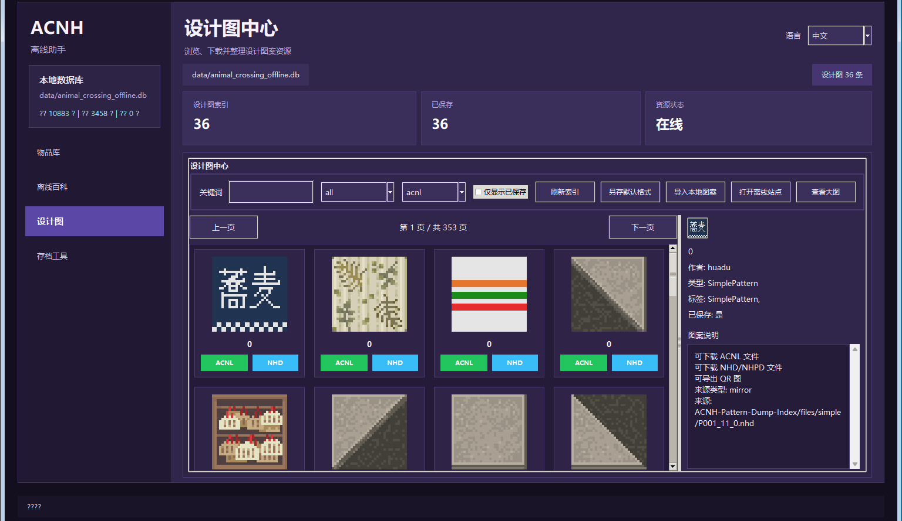

# Animal Crossing Offline Assistant



动森离线助手是一个面向《集合啦！动物森友会》的本地桌面工具，提供物品中英对照、离线百科、设计图浏览导出，以及存档相关工具入口。

Animal Crossing Offline Assistant is a local desktop helper for Animal Crossing: New Horizons, focused on bilingual item lookup, offline encyclopedia browsing, pattern export, and save-tool integration.

## 中文说明

当前仓库已内置运行所需的核心数据与构建脚本，不再依赖运行时直接读取 `items.csv`。

主要功能：

- 物品数据库中英文对照搜索
- 分类筛选、类型筛选、复制英文或中文名称
- 离线百科与图鉴浏览
- 设计图中心本地浏览、导出 `.acnl`、`.nhd/.nhpd`、`QR/PNG`
- 本地镜像优先的设计图资源访问
- 集成 NHSE 与 ACNHDesignPatternEditor 启动入口
- 支持中英界面切换，默认中文

仓库包含：

- `app.py`：桌面应用主程序
- `pattern_support.py`：设计图索引、缓存与导出逻辑
- `tool_support.py`：NHSE、设计图编辑器、本地镜像相关逻辑
- `plMining.py`：设计图库数据挖掘与统计分析模块
- `build_database.py`：SQLite 数据库构建脚本
- `build.ps1`：一键构建数据库并打包 EXE
- `data/animal_crossing_offline.db`：主数据库
- `dist/ItemsBilingualViewer.exe`：已打包的 Windows EXE

本地运行：

```powershell
py -3.11 app.py
```

自检：

```powershell
py -3.11 app.py --self-test
```

设计图库数据挖掘报告：

```powershell
py -3.11 plMining.py
py -3.11 plMining.py --report creators
py -3.11 plMining.py --report types
py -3.11 plMining.py --report tags
py -3.11 plMining.py --top 10
```

重新打包：

```powershell
powershell -ExecutionPolicy Bypass -File .\build.ps1
```

## English

This repository ships with the core data and scripts needed to run the app locally. It does not depend on loading `items.csv` at runtime.

Key features:

- bilingual item lookup with Chinese and English names
- category and type filters with one-click copy for names
- offline encyclopedia browsing
- local-first pattern browsing and export for `.acnl`, `.nhd/.nhpd`, and `QR/PNG`
- built-in launchers for NHSE and ACNHDesignPatternEditor
- Chinese and English UI switching, with Chinese as the default

Important files:

- `app.py`: desktop application entry point
- `pattern_support.py`: pattern indexing, cache, and export logic
- `tool_support.py`: external tool and local mirror integration
- `plMining.py`: pattern library mining and statistical analysis
- `build_database.py`: SQLite database builder
- `build.ps1`: rebuild and package script
- `data/animal_crossing_offline.db`: main database
- `dist/ItemsBilingualViewer.exe`: packaged Windows executable

Run locally:

```powershell
py -3.11 app.py
```

Self-test:

```powershell
py -3.11 app.py --self-test
```

Pattern library mining reports:

```powershell
py -3.11 plMining.py
py -3.11 plMining.py --report creators
py -3.11 plMining.py --report types
py -3.11 plMining.py --report tags
py -3.11 plMining.py --top 10
```

Package the EXE:

```powershell
powershell -ExecutionPolicy Bypass -File .\build.ps1
```

## Data Sources

- Local `items.csv`
- Lightweight cached Nookipedia-derived knowledge data
- NHSE text and sprite assets: https://github.com/kwsch/NHSE
- ACNHDesignPatternEditor reference project: https://github.com/FluffyFishGames/ACNHDesignPatternEditor
- ACNH Pattern Dump Index: https://www.vectorcmdr.xyz/ACNH-Pattern-Dump-Index/

## License

This repository is distributed under GPL-3.0 because it includes and derives data or assets from GPL-3.0 projects such as NHSE and ACNHDesignPatternEditor.
